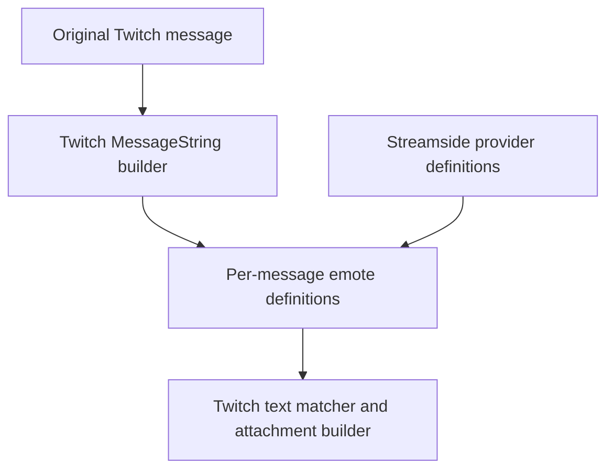

# Twitch 31.5: native presentation enrichment boundary

> Scope correction: this document describes the legacy chat path present in the
> Twitch 31.5 binary. Earlier device validation does not establish compatibility
> with the currently active React Native chat. See [the passive RN probe](RN_CHAT_BOUNDARY_PROBE.md).

This records the initial read-only investigation. The subsequent
[build-50 trial](TWITCH_31_5_PRESENTATION_TRIAL.md) validates the definition
identity, native asset-type argument and proportional geometry path, and
implements the adapter. Statements below about unimplemented work describe
the state when this investigation was written.

## Finding

Prefer the **per-message emote-definition response from
`MessageString.informationDelegate`**. Specifically:

```text
currentChannelUnlockedSubscriberEmotesForMessageString:
Objective-C encoding: @24@0:8@16
```

The supplied 31.5 donor implements this on both `Twitch.ChatDataSource` and
`Twitch.ChatTranscriptView`. Its renderer actually dispatches this selector
through Objective-C, then consumes the returned `NSArray<TKChatEmote *>` when
formatting text tokens. This is stronger evidence than selector presence alone.

Streamside can augment that response with provider definitions for the one
message being formatted. Twitch then recognizes their names, creates its own
attachments and records its own presentation token/location metadata. There is
no need to replace the original `TWChatMessage`, its token array, or the
`ChatMessageString` object.



This is a static donor finding and implementation design, not an observed
iPhone trace or a tested regression fix. The locally echoed message is inferred
to use this path because it retains ordinary text tokens and reaches chat
presentation; an on-device callback count must confirm which delegate receives
that particular echo. No new rendering hook or test IPA is added by this report.

## Evidence: construction rather than late display

Addresses below are unslid forensic references for the exact donor in
[the build-48 report](TWITCH_31_5_COMPATIBILITY.md), not runtime patch offsets.
Main image UUID: `6A2F9D5F-C563-3B41-9EDE-0CE9D0A0EFF5`.
TwitchKit addresses are relative to its image, whose preferred base is zero.

| Stage | Donor evidence | Implication |
| --- | --- | --- |
| Chat text construction | `ChatMessageString` worker `0x101fcb5b0` reads the stored original base message and obtains its tokens, then calls `0x1042bc52c` at `0x101fcca34` | Enrichment can happen during formatting, before layout and cell reuse |
| Context acquisition | `0x1042bc52c` loads `informationDelegate` with `swift_unknownObjectWeakLoadStrong` | The callback receiver belongs to this presentation object |
| Native emote definitions | Calls at `0x1042bc700` and `0x1042bc758` dispatch follower/subscriber selectors through stubs `0x1052637e0` / `0x105263800` | Swizzling the delegate methods intercepts real renderer calls even when a Swift caller bypasses `rebuildTextStorage` |
| Typed consumption | Returned arrays are bridged using `TKChatEmote` metadata, concatenated and indexed by code | Values must be real `TKChatEmote` objects, not arbitrary dictionaries or image URLs |
| Token visitation | Both token iteration paths dispatch `switchBitsToken:emoteToken:gifToken:mentionToken:textToken:urlToken:` (`0x1042bd344` / `0x1042bd958`) | Native URL, mention, bits, GIF and emote branches remain in charge |
| Ordinary text callback | TwitchKit `TWMessageTextToken` method `0x2ac15c` invokes the supplied text block from `x6`; the renderer's callback reaches `0x1042c03b8` | This is the fallback that can turn a locally echoed emote name into presentation metadata |
| Native matching | `0x1042c03b8` splits text and looks up pieces in the code dictionary | Streamside need not splice text or compute rendered character offsets |
| Native attachment construction | The match branch allocates `NSTextAttachment` (`0x1042c0900`), builds its attributed string (`0x1042c0954`), and appends it | Twitch creates the attachment and accounts for surrounding text/prefixes |
| Presentation token insertion | It takes identifier/code from the matched `TKChatEmote`, constructs `TWMessageEmoteToken` (`0x1042c06e0`), and inserts it into the presentation object's `emoteLocationsMap` (`0x1042c0714`) | These tokens are presentation metadata; they are not written into the original message's tokens |
| Image lookup | `ChatMessageString.messageStringImageDatasByLocation` reaches the base image builder `0x1042bb2b4` through a call at `0x101fcdb64` | Native image data is derived from the location map; existing synthetic-ID URL interception can supply provider images |

The image builder reads `TWMessageEmoteToken.emoteId` and constructs Twitch CDN
URLs. Streamside already recognizes its synthetic IDs in those requests and
resolves their provider images. Existing proportional sizing and tap code also
reads emote-token values from `emoteLocationsMap`. This makes the definition
callback fit the current image/sizing/detail architecture without a second
attachment renderer.

The Objective-C bridge for a definition survives:

```text
TwitchKit.TKChatEmote
initWithIdentifier:code:modifiedEmotes:assetType:
@48@0:8@16@24@32q40
```

Its wrapper bridges NSString/NSArray arguments to the native initializer.
Provider definitions can use the existing synthetic decimal ID and original
emote code. The asset-type value must be validated before a trial; do not guess
an enum value from its integer encoding. No identity/message constructor or
Swift String/Array storage writer is required.

## Delegate coverage and context

| Receiver | Subscriber IMP | Follower IMP | Available scope |
| --- | --- | --- | --- |
| `Twitch.ChatDataSource` | `0x102ca9410` | `0x102ca9154` | Named `channelID` UInt32 field and `emoteManager` reference |
| `Twitch.ChatTranscriptView` | `0x10255c370` | `0x10255c09c` | Named optional `channelID` field; its native callback checks the nil discriminator |

The donor also has a VOD-specific information delegate. It should be left out
of the initial live-chat trial. Inherited methods on transcript subclasses
need separate installation/coverage checks, not duplicate hooks that apply the
same enrichment twice.

The native subscriber callbacks inspect the message's sender and compare it
with the emote manager's current-user ID before returning unlocked emotes.
That helps identify this as the path for account-authored text needing client
side recognition, but **an empty response is not an own-message predicate**:
it can also mean another sender, no unlocked emotes, missing account state or
missing channel scope.

Use the exported `ChatMessageString.chatMessage` and `TWChatMessage.senderId`
getters for the original message and sender. `ChatDataSource.emoteManager`
provides a potential independent account authority. The donor names its
`currentUserID` field; native code reads a UInt32 plus an optional nil byte.
Its observed storage is 280 with five bytes, followed by `recommendedEmotes`
at 288. These are evidence, not constants to copy into production. A read
requires runtime class/field/span/bounds checks and validation of the optional
representation. Do not decode `senderIdentity` or assume any empty native
result means the current user.

Transcript-only coverage still needs a safe account-authority binding; its
native method uses the shared Swift emote manager internally. It does not
expose that singleton through an Objective-C getter. Borrowing the last active
room or a stale account snapshot would defeat the narrow scope.

## Minimal trial design

1. Hook the two live delegate implementations with the exact method encoding.
   Keep separate saved original IMPs. Observe the follower response and augment
   only the subscriber response so one rebuild gets one provider contribution.
2. Call the original method first and preserve every native definition. Resolve
   the presentation's original message, its current account sender and the
   receiver's exact channel. If any authority/layout/type is unavailable, return
   the original response.
3. Match only exact ordinary `TWMessageTextToken` objects from the original
   token array against the already loaded provider registry. Do not fetch,
   sort full catalogs or block the renderer on network work. Definitions are
   per-message, bounded and limited to actually matched provider names.
4. Preserve native codes from both native responses and existing native token
   objects. Skip conflicts and duplicate provider definitions. Do not introduce
   synthetic definitions for native names, links, mentions, bits or GIF tokens.
5. Conservatively skip enrichment for messages containing moderated/censored
   text subclasses. The native fallback text handler also handles
   `TWMessageAutoModTextToken` and `TWMessageCensoredTextToken`; supplying a
   matching definition can enter its emote branch before its unmatched-text
   moderation branch. Keeping their original objects alone is insufficient.
6. Construct real `TKChatEmote` definitions through the verified constructor,
   return the merged NSArray using the method's normal +0 return convention,
   and leave the original message/presentation objects in place.
   Twitch's bridge retains the values it consumes. Do not retain raw message
   pointers beyond the formatting operation.

The initial trial should confirm callback coverage for the own local echo,
provider-definition admission, native synthetic location entries, attachment
construction and image requests. Aggregate counts and pointer-identity equality
checks are sufficient; chat text, account IDs, channels and URLs need not be
logged. This can remain part of normal integration counters without importing
the forensic probe branches.

Device validation should include ordinary sending, composer-selected sending,
replies/prefixes, native emotes, URLs, moderation/censoring, scrolling/reuse,
channel changes/shared chat and account changes. Shared-chat messages from other
channels require an authoritative source-channel scope or must pass through.

## Why the earlier candidates are inferior

| Candidate | Verified problem |
| --- | --- |
| `rebuildTextStorage` swizzle | Many construction/copy/update paths directly call its Swift worker, bypassing the Objective-C wrapper |
| `setEmoteLocationsMap:` swizzle | Builder resets/writes the Swift field directly; it is not the call it uses to admit definitions |
| `emoteLocationsMap` getter augmentation | Attachments and text storage have already been constructed; late extra entries do not reserve text or create an attachment |
| `messageStringImageDatasByLocation` augmentation | Supplies images for existing locations but cannot by itself turn literal text into an attachment |
| Cell `apply:` | Later than formatting and vulnerable to reuse/rebuild differences; requires repairing multiple already-built presentation structures |
| Token visitor interception | Real dispatch exists, but a token alone lacks reliable message/channel/account context; the definition callback already provides the presentation argument |

## Verification and remaining limits

Read-only checks against the supplied IPA verified ten relevant direct call
edges, the three renderer-dispatched selectors, both live delegate method
encodings, the definition constructor encoding and the text-token block
dispatch instructions. Objective-C metadata and dyld chained-import bindings
were decoded from the donor; the executable was not loaded or modified.

No application code changed during this boundary investigation. The clean
build-49 compatibility source remains the baseline for a subsequent trial.
Live echo coverage, transcript-only account binding, asset-type selection and
provider image/animation behavior remain device/implementation validation
items, not completed claims.
